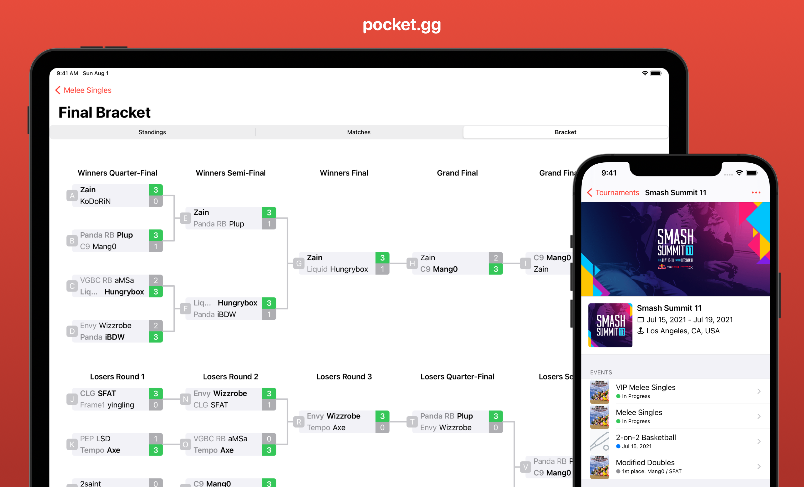

# pocket.gg

An iOS mobile client for the [smash.gg](https://smash.gg/) website, written in Swift

## Features
* Discover upcoming and featured tournaments for your favourite video games
* View tournament details such as events, location, contact info, etc.
* Easy access to tournament live streams and registration
* Native bracket view with pinch-to-zoom controls for single/double elimination and round robin brackets
* Follow tournament organizers to see when the next local or regional is
* Search for any tournament on smash.gg
* Profile page where you can view tournaments that you're organizing or competing in
* Pin your favourite tournaments for easy access

## Screenshots

